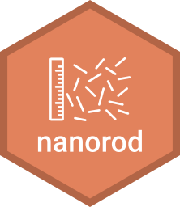

<!-- README.md is generated from README.Rmd. Please edit that file -->

# nanorod 

<!-- badges: start -->

[](https://www.tidyverse.org/lifecycle/#experimental)
<!-- badges: end -->

`nanorod` is an interface to automatically measure the length of
nanorods from a greyscale image formed in a transmission electron
microscope (TEM) and analyse the results.

## Installation

First, we need to install the package itself by following the step
below.

### Install nanorod

``` r
install.packages("devtools")
devtools::install_github("ruthkr/nanorod")
```

*Notice that this is still under active development*.

The `nanorod` package uses some Python modules, and they need to be
installed within a Python environment on your system. You can install
Python and set up your environment by simply following the step below.

``` r
library(nanorod)
set_up_python()
```

**Note that this only needs to be run once**, i.e. the first time you
use `nanorod`.

## Running nanorod

To run the `nanorod` interface locally, we can run the following command
on the R console, which will invoke the Shiny user interface:

``` r
library(nanorod)
run_app()
```

Alternatively, `nanorod` can be accessed online on
<https://ruthkr.shinyapps.io/nanorod/>.
